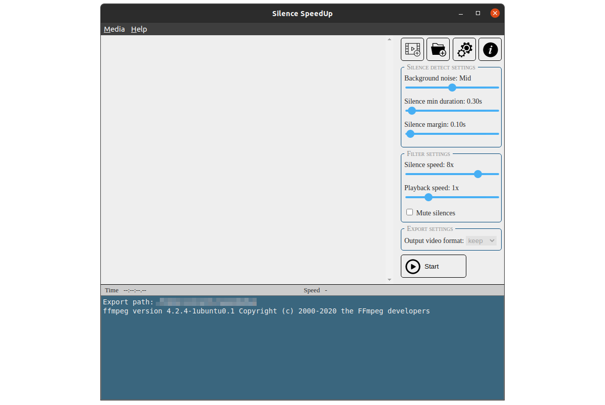

# Silence Speedup
Velocizza i tuoi video velocizzando (o rimuovendo) i silenzi, tramite FFmpeg.



*Leggi in altre lingue: [Inglese](README.md), [Italiano](README.it.md).*

## Indice dei contenuti
  - [Installazione](#installazione)
    - [Requisiti](#requisiti)
  - [Come funziona](#come-funziona)
    - [Grafica](#grafica)
      - [Interfaccia di default](#interfaccia-di-default)
      - [Interfaccia minimale](#interfaccia-minimale)
    - [Funzionamento interno](#funzionamento-interno)
      - [Note](#note)
  - [Crediti](#crediti)

## Installazione
Questo programma è stato impacchettato con [``electron-packager``](https://electron.github.io/electron-packager/master/), e dovrebbe funzionare così com'è. Se vuoi invece eseguire il programma dal codice sorgente, devi:

1.  [Installare ``Electron JS``](https://www.electronjs.org/docs/tutorial/installation);

2.  [Creare una nuova applicazione Electron vuota](https://www.electronjs.org/docs/tutorial/quick-start);

    ```
    mkdir my-electron-app && cd my-electron-app
    npm init -y
    npm i --save-dev electron
    ```

3.  Copiare e incollare tutti i file nella cartella della tua applicazione;

4.  [Scaricare/Installare FFmpeg](https://ffmpeg.org/download.html);

5.  Aprire ``code/index.js``, cercare ``class FFmpeg`` e rimpiazzare il valore di ``command`` (``null``) con il percorso dell'eseguibile di ffmpeg (o il suo comando);

    ``static command = null;`` ➜ ``static command = "path/to/ffmpeg";``

6.  Ora puoi eseguire l'applicazione.

    ```
    npm test
    ```

### Requisiti
Per le versioni ``win32`` e ``darwin`` l'eseguibile di ``ffmpeg`` è incluso nel pacchetto; su ``linux`` è necessario che sia installato manualmente.

## Come funziona

### Grafica

#### Interfaccia di default


#### Interfaccia minimale


### Funzionamento interno
Per ogni video, questo programma:

1. Eseguirà ffmpeg con il filtro ``silencedetect``, per ottenere l'elenco dei timestamp di inizio/fine dei silenzi.

    ```
    <ffmpeg bin> -hide_banner -vn \
      -ss 0.00 -i <Input file> \
      -af silencedetect=n=<threshold>:d=<duration> \
      -f null -
    ```

2. Usando quell'elenco, dividerà il video originale dentro una cartella tmp, applicando un filtro di velocità, se presente.

    ```
    <ffmpeg bin> -hide_banner -loglevel warning -stats \
      -ss <Start time> -to <End time> -i <Input file> \
      -filter_complex "[0:v]<setpts filter>[v];[0:a]<atempo filter>[a]" \
      -map [v] -map [a] <Output fragment>
    ```

3. Concatena tutti i frammenti generati precedentemente.

    ```
    <ffmpeg bin> -hide_banner -loglevel warning -stats \
      -f concat -safe 0 \
      -i <Fragment list file> \
      -c copy \
      -map v -map a <Output file> -y
    ```

#### Note
Al termine dell'esecuzione, il programma non pulisce automaticamente la cartella tmp.

## Crediti
Questo software usa delle librerie del progetto FFmpeg, che io non possiedo, sotto la licenza LGPLv2.1.
