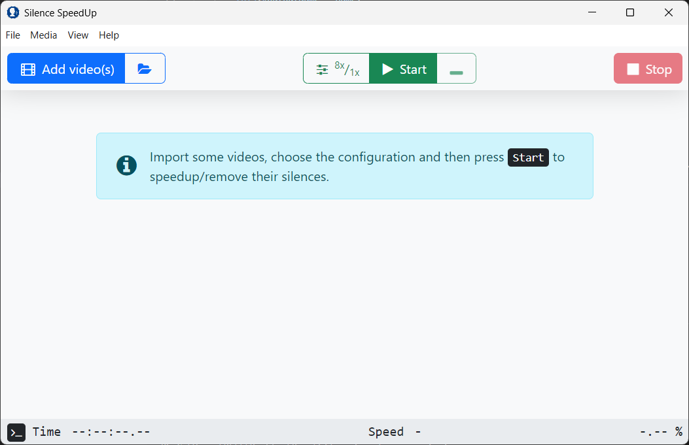

# Silence Speedup

**Silence Speedup** is a desktop application built with [Electron](https://www.electronjs.org/)
that analyzes videos or audio files to detect silent sections and either speed them up or
remove them entirely.
Powered by [FFmpeg](https://ffmpeg.org/), it helps you reduce unnecessary pauses and make your
content more concise.

Ideal for lectures, interviews, podcasts, or tutorials — especially when the speaker pauses
frequently or speaks slowly.

## 📦 Download

Latest release: **v1.2.5**

- [Windows (x64)](https://github.com/padvincenzo/silence-speedup/releases/download/v1.2.5/Silence-SpeedUp-v1.2.5-win32-x64.zip)
- [macOS (x64)](https://github.com/padvincenzo/silence-speedup/releases/download/v1.2.5/Silence-SpeedUp-v1.2.5-darwin-x64.zip)
- [Linux (x64)](https://github.com/padvincenzo/silence-speedup/releases/download/v1.2.5/Silence-SpeedUp-v1.2.5-linux-x64.zip)

## 🚀 Getting Started

1. Launch the application
2. Import your video or audio file
3. Adjust silence detection, playback speed and other settings (optional)
4. Click **Start**

The app will detect silence, process each section, and generate a shortened version of your file.

> For detailed instructions, see [`docs/usage.md`](docs/usage.md)

## ✨ Key Features

- 🎙️ **Custom silence detection** — adjust noise sensitivity, min silence length, and margin
- ⏩ **Silence skipping or speeding** — choose how silent parts are handled
- 🎛️ **Advanced export settings** — frame rate, codec presets, audio format
- 💻 **Cross-platform** — works on Windows, macOS, and Linux
- ⚡ **Fast processing** — powered by efficient FFmpeg commands

## 🛠 Requirements

- **No installation required** for pre-built versions
- To run from source:
  - [Node.js](https://nodejs.org/)
  - FFmpeg (included in packaged releases)

> For development and build instructions, see [`docs/development.md`](docs/development.md)

## 🤝 Contributing

You're welcome to contribute by:
- Reporting issues or bugs
- Translating the app or documentation
- Suggesting improvements
- Implementing new features
- Sharing the project with others
- [Buying me a coffe](https://paypal.me/VincenzoPadula)

## 📜 Credits

This software uses [FFmpeg](https://ffmpeg.org/) under the **GPLv3** license.  
The graphical interface is built using [Electron](https://www.electronjs.org/).

## 📚 Additional documentation:
- [Usage Guide](docs/usage.md)
- [Development Guide](docs/development.md)
- [FFmpeg Technical Details](docs/ffmpeg-details.md)
